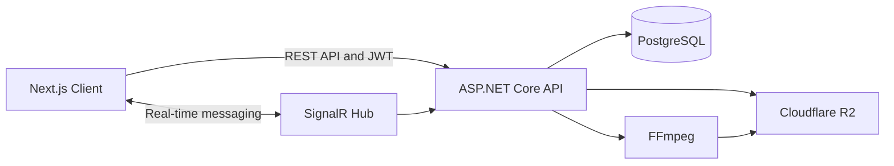

# TallyPRs

TallyPRs is a full-stack social fitness platform where lifters can share personal records, connect with other athletes, and have submitted lifts reviewed by administrators.

## Overview

TallyPRs combines strength tracking with the social features of a modern community platform. Users can post personal-record attempts with image or video evidence, interact with other lifters, follow profiles, receive notifications, and communicate through real-time messaging.

Administrators can review submitted lifts and update their validation status, creating a structured system for verified personal records.

## Features

* Secure account registration and login
* JWT access-token and refresh-token authentication
* Role-based authorization for members and administrators
* Customizable user profiles
* Profile-picture uploads
* Personal-record posts with images and videos
* Administrator lift review and validation
* Comments and threaded replies
* Likes and downvotes
* Following and follower systems
* Mutual-follow indicators
* Real-time direct messaging
* Unread message counts
* Social notifications
* Cursor-based pagination
* Feed filtering
* Rate-limited API endpoints
* Responsive desktop and mobile layouts

## Tech Stack

### Frontend

* Next.js
* React
* TypeScript
* Tailwind CSS
* SignalR JavaScript client

### Backend

* ASP.NET Core Web API
* .NET 10
* Entity Framework Core
* ASP.NET Core Identity
* JWT authentication
* SignalR
* REST APIs

### Database and Infrastructure

* PostgreSQL
* Cloudflare R2
* FFmpeg
* Docker
* Azure App Service
* Vercel
* GitHub Actions

## Architecture



The Next.js frontend communicates with the ASP.NET Core backend through authenticated REST requests.

PostgreSQL stores application data, Cloudflare R2 stores uploaded media, and FFmpeg compresses and processes videos. SignalR provides real-time communication for direct messaging.

## Media Processing

Uploaded media is validated and processed before being attached to a post.

For video uploads, the backend:

1. Receives and validates the uploaded file.
2. Processes the video using FFmpeg.
3. Normalizes the frame rate and video dimensions.
4. Compresses the video using H.264 and AAC.
5. Enables fast-start playback for web clients.
6. Generates and uploads media files to Cloudflare R2.
7. Stores the resulting media information in PostgreSQL.

This process significantly reduces uploaded file sizes while maintaining practical playback quality.

## Authentication and Security

TallyPRs includes several authentication and security features:

* Password management through ASP.NET Core Identity
* Short-lived JWT access tokens
* Refresh-token authentication
* Role-based access control
* Protected API endpoints
* Request rate limiting
* Server-side file validation
* Secure cloud-storage operations
* Configured CORS policies
* Unique database constraints for votes and follows

## Main Data Models

The application includes the following primary entities:

* `User`
* `Profile`
* `PRPost`
* `Lift`
* `Media`
* `Comment`
* `Vote`
* `Follow`
* `Notification`
* `Conversation`
* `ConversationParticipant`
* `Message`
* `RefreshToken`

Entity relationships and database constraints are configured through Entity Framework Core.

## Getting Started

### Prerequisites

Install the following:

* .NET 10 SDK
* Node.js
* npm
* PostgreSQL
* FFmpeg
* Docker
* Entity Framework Core CLI

Install the Entity Framework Core CLI:

```bash
dotnet tool install --global dotnet-ef
```

### Clone the Repository

```bash
git clone YOUR_REPOSITORY_URL
cd YOUR_REPOSITORY_NAME
```

## Backend Setup

Navigate to the backend project:

```bash
cd tallyprs-api
```

Restore the dependencies:

```bash
dotnet restore
```

Configure the required environment variables or development settings:

```json
{
  "ConnectionStrings": {
    "DefaultConnection": "YOUR_POSTGRESQL_CONNECTION_STRING"
  },
  "Jwt": {
    "Key": "YOUR_JWT_SECRET",
    "Issuer": "YOUR_JWT_ISSUER",
    "Audience": "YOUR_JWT_AUDIENCE"
  }
}
```

You will also need to configure:

* Cloudflare R2 endpoint
* Cloudflare R2 access key
* Cloudflare R2 secret key
* R2 bucket name
* Frontend URL
* FFmpeg settings

Apply the database migrations:

```bash
dotnet ef database update
```

Run the backend:

```bash
dotnet run
```

## Frontend Setup

Navigate to the frontend project:

```bash
cd YOUR_FRONTEND_DIRECTORY
```

Install the dependencies:

```bash
npm install
```

Create a `.env.local` file:

```env
NEXT_PUBLIC_API_URL=YOUR_BACKEND_URL
```

Run the frontend:

```bash
npm run dev
```

## Docker

Build the backend Docker image:

```bash
docker build -t tallyprs-api .
```

Run the container:

```bash
docker run --env-file .env -p 8080:8080 tallyprs-api
```

Make sure the Docker image uses a .NET SDK and runtime version compatible with .NET 10.

## Deployment

The application is designed to use the following production architecture:

* **Frontend:** Vercel
* **Backend:** Azure App Service
* **API deployment:** Docker container
* **Database:** PostgreSQL
* **Media storage:** Cloudflare R2
* **Continuous deployment:** GitHub Actions

Production secrets should be stored through the hosting provider and should never be committed to the repository.

## Engineering Highlights

* Built a full-stack social platform using Next.js, ASP.NET Core, PostgreSQL, and cloud object storage.
* Implemented JWT and refresh-token authentication with role-protected administrator functionality.
* Created cursor-based pagination for scalable feed and messaging endpoints.
* Integrated Cloudflare R2 for profile pictures, images, videos, and thumbnails.
* Built an FFmpeg media pipeline to compress uploaded videos and improve playback performance.
* Added SignalR-based real-time direct messaging with automatic reconnection.
* Designed comments, replies, votes, follows, notifications, and user-profile systems.
* Dockerized the backend and configured cloud deployment workflows.
* Resolved issues involving CORS, authentication claims, database relationships, mobile layouts, and container deployment.

## Author

**Cody Cintron**

Computer Science student at Florida State University focused on full-stack software engineering, backend development, and cloud-based applications.
